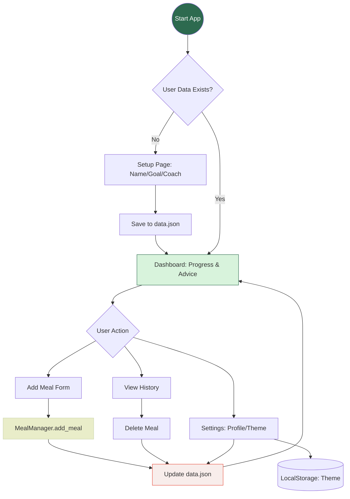

# NutriTrack: Smart Nutrition Dashboard

NutriTrack is a dynamic web application designed to help users monitor their daily calorie intake and receive intelligent nutritional feedback based on their eating habits.

### 🎯 What does it do?

The app allows users to:

- Log meals with specific categories.
- Calculate the remaining daily calorie budget in real-time.
- Provide smart insights to help maintain a healthy lifestyle.

### ✨ The "New Feature"

**Smart Behavioral Insight System:** An automated system that analyzes dietary patterns and provides personalized advice, integrated with a dynamic UI that visualizes progress using logic-driven color thresholds.

## 🏗 Project Workflow

## 📸 Visual Preview

Detailed screenshots of the application in both Light and Dark modes can be found in the /screenshots folder.

### 🛠 Prerequisites

- **Flask** (Install via: `pip install flask`)

### 📋 Project Checklist

- [x] It is available on GitHub.
- [x] It uses the Flask web framework.
- [x] It uses at least one module from the Python Standard Library other than the random module.
  - **Module name:** `datetime`, `json`
- [x] It contains at least one class written by you that has both properties and methods.
  - **File name:** `meal_manager.py`
  - **Line number(s):** `3-87`
  - **Properties:** `daily_limit`, `meals_list`
  - **Methods:** `add_meal`, `calculate_remaining_calories`, `get_nutrition_advice`
  - **Usage:** Used in `app.py` to handle core logic and calorie calculations
- [x] It makes use of JavaScript in the front end and uses the `localStorage` of the web browser.
- [x] It uses modern JavaScript (`let` and `const`).
- [x] It makes use of the reading and writing to the same file feature.
- [x] It contains conditional statements.
  - **File name:** `meal_manager.py` | **Line number(s):** `76-87`
  - **File name:** `app.py` | **Line number(s):** `50, 54, 66, 67`
- [x] It contains loops.
  - **File name:** `meal_manager.py` | **Line number(s):** `32,41`
- [x] It lets the user enter a value in a text box at some point.
- [x] It doesn't generate any error message even if the user enters a wrong input.
- [x] It is styled using your own CSS.
- [x] The code follows conventions, is fully documented, and doesn't use `print()` or `console.log()`.
- [x] All exercises have been completed and pushed to GitHub.
